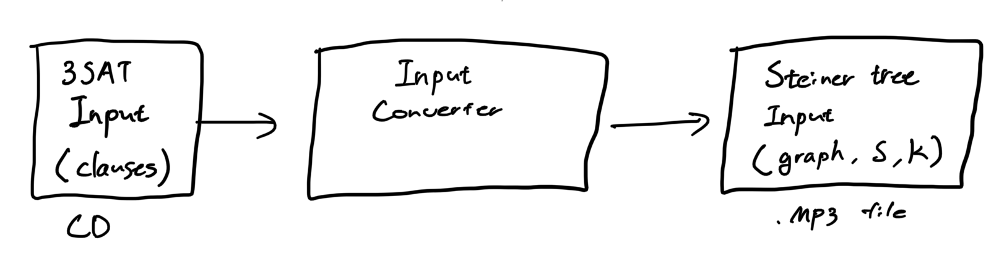
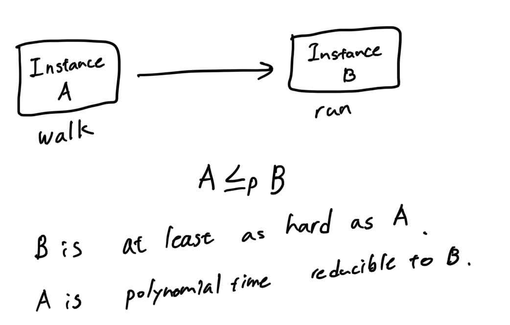
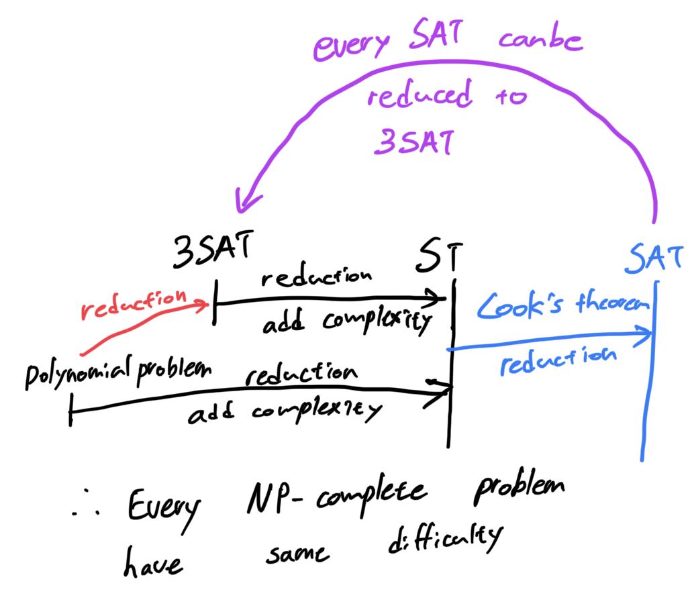
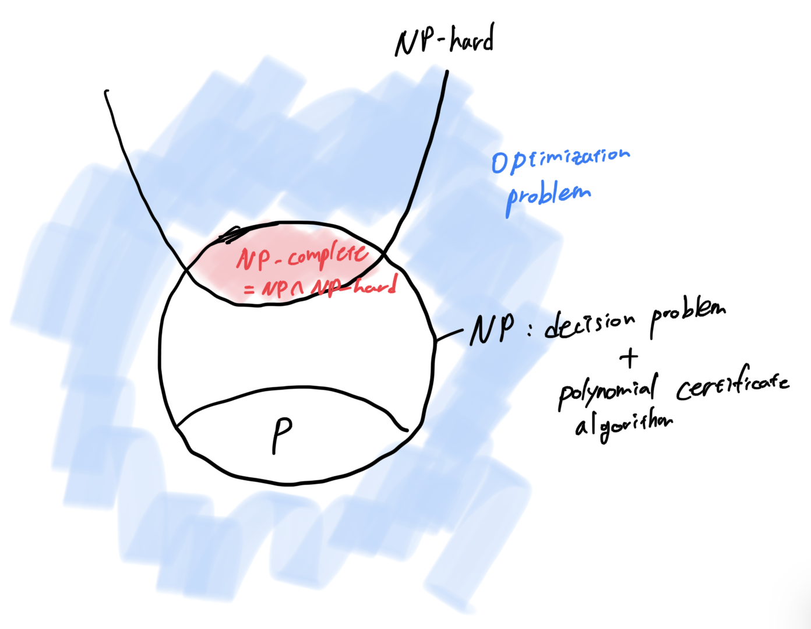

# Q4. Reductions and NP-completeness

## Definitions
### Reduction
- Adding complexity to the problem. (Make problem more difficult)

- Analogy


### Reduction cycle


### P and NP
- P: the set of problems solvable in polynomial time on a normal computer
- NP: the set of problem solvable in polynomial time on a non-deterministic computer (computer that have infinite cores).
- Diagram


### Decision problem
- The problem has a yes/no answer.

### P, a bit more formally
- The set of decision problems, solvable in polynomial time on a deterministic Turing machine (Normal computer we use).

### NP
- First, the problem need to be decision problem.
- The set of decision problems where you can check that the answer is yes in polynomial time on a deterministic Turing machine.
- **Certificate algorithm which checks the input is True or False, takes polynomial time.**

### non-NP
- Optimization problems

### NP-hard
- Problems we can reduce from NP.
- It is at least as hard as NP.

### NP-complete
- Within NP, meaning it is decision problem.
- Also, NP-hard

### Cook's theorem
- Every problem in NP is polynomial time reducible to SAT.
- NP-Complete: hardest problem in NP

---
# NP-completeness (NP ⋂ NP-hard) Proof structure
**There are two parts to the proof.** 

## Part 1. Prove problem is in NP
- **Check if the certificate algorithm runs in polynomial time**
-  Certification algorithm: algorithm that takes input and possible solution. Then verifies if that solution is correct. If this algorithm runs in polynomial time, the problem is in NP.
- The ST problem is in NP **if there is an efficient algorithm—called the certification algorithm that takes as input an instance I = ((V, E), S, k) of ST and a potential solution E′, and correctly determines if E′ is a good solution.**
- we can check that **(1) the set of edges in E′ has size at most k (|E′| ≤ k)** and **(2) the edges connect all the shaded vertices**, in polynomial time. DFS runs in O(n).
- For (2), checking all the shaded vertices are connected by edges, we run DFS on potential solution E'. If E' includes all the vertices of S, within k, the the certification algorithm will return True.
---
## Part 2. Prove problem is NP-hard
### Part 2.1. Present a reduction from a known NP-hard problem
- **Part 2.1.1. Prove the reduction can be done in polynomial time.**
    ```
    Example of Steiner tree
    Given an instance of 3SAT, we construct an instance of ST as follows
    i) We create a "hub" vertex h
    ii) For each variable v in the 3SAT instance, create 3 variables labeled v, ¬v and v_tip. Then, connect v and ¬v to hub and v_tip. / runtime: O(Variables)
    iii) For each clase, create a new "clause vertex" and connect it to vertices labeled with the literals in the clause. / runtime: O(Clauses)
    iv) Let S (the set of shaded vertices) be the hub vertex, all of tip vertices and all of clauses vertices. / runtime: O(Variables + Clauses + 1)
    v) Let K = 2 * N(variables) + N(clause)
    vi) return (G, K, S). which is input to Steiner tree
    ∴ Input (or intance) can be reduced in polynomial time
    ```
    
- **Part 2.1.2. Prove the reduction is correct: Input to I → I'**
  - Global fields: Graph structure, k, set of shaded vertices S
  - Part 2.1.2.1. Yes input on original problem I → Yes input on reduced problem I'
    - Premise: Instance I is Yes in 3SAT.
      - it means there must be some assignment of truth value to the variables that make every clause true.
      - Variable gadget represents the true/false of variables.
    - According to the graph gadget, true variables will take toal 2 * N(variables) edges.
    - Then we are left with N(clause) edges. If we connect N(clause) edges to truth assigned variable, then we use all of k edges. Thus, the ST input is also Yes.

  - Part 2.1.2.1. No input on original problem I → No input on reduced problem I'
    - It is difficult to show, we use contrapositive: Yes input on reduced problem I' → Yes input on original problem I
    - Premise: Instance I' is Yes in Steiner Tree.
    - (1) Use property that a tree with n vertices have n - 1 edges. So in the ST instance, there are k edges. And therefore, there are k + 1 vertices. In ST instance, k = 2 * N(Variable) + N(Clause). So, there are 2 * N(variable) + N(clause) + 1 vertices.
    - (2) There are N(variable) + N(clause) + 1 hub shaded vertices, which all must be connected.
    - If we substract (2) from (1), then we are left with N(variable) vertices, which are unshaded node of the graph.
    - This means that we can use $ \frac{N(variable)}{2N(variable)} $ , which implies that there is one variable assignment to SAT.